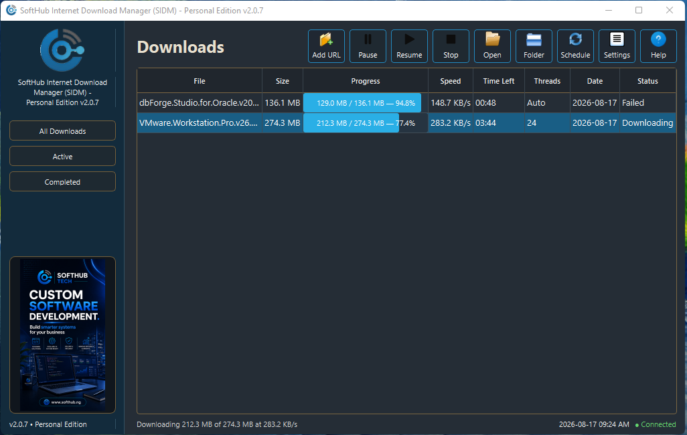
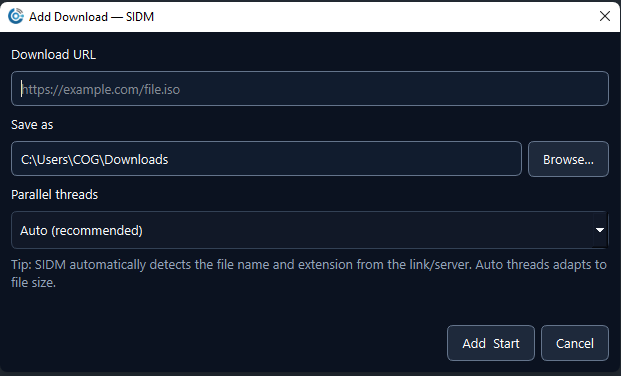
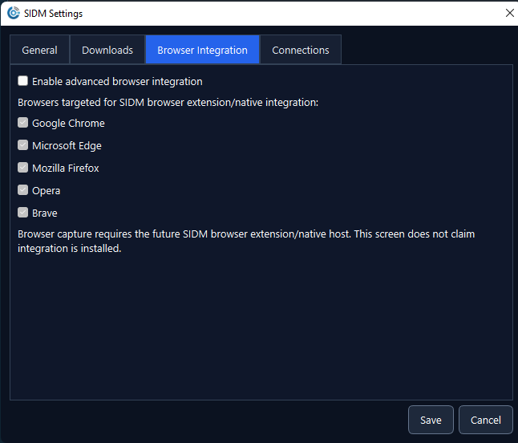
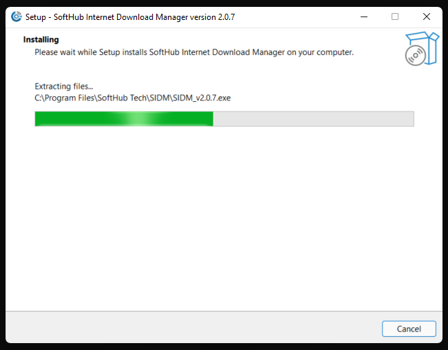
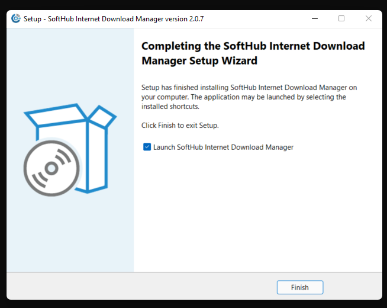

# SIDM
SIDM (SoftHub Internet Download Manager) is a free download manager for Windows made by SoftHub Tech. It speeds up your downloads using multiple threads and is designed to be fast, modern, and smart about how it handles files.

# SIDM — SoftHub Internet Download Manager

  

  <strong>Fast. Modern. Intelligent downloading for Windows.</strong>

  SIDM (SoftHub Internet Download Manager) is a modern multi-threaded
  download manager for Microsoft Windows developed by SoftHub Tech.

---

## Download SIDM

### Current Release: v2.0.7 — Personal Edition

Download the latest installer from the **Releases** section of this repository.

**Installer:** `SIDM_Setup_v2.0.7.exe`

> SIDM Personal Edition is available free of charge for personal use.

---

## SIDM in Action

SIDM provides a clean download dashboard showing file size, progress,
download speed, estimated time remaining, thread count, date and status.

---

## Features

- Multi-threaded / segmented downloading
- Automatic thread selection
- Manual parallel-thread configuration
- Up to 64 threads where supported
- Pause and resume downloads
- Stop and restart download operations
- Real-time download progress
- Real-time download speed monitoring
- Estimated time remaining
- Automatic filename and extension detection
- Download folder selection
- Individual segment monitoring
- Active and completed download views
- Download scheduling
- Configurable connection settings
- Modern Windows desktop interface
- Native Windows installer
- Start Menu integration
- Self-contained installation
- No separate Python installation required

---

## Smart Filename Detection

Paste a direct download URL into SIDM.

SIDM attempts to determine the actual filename and extension automatically
from the URL and information returned by the remote server.

The destination can still be changed manually before starting the download.

---

## Parallel Download Engine

SIDM can split compatible downloads into multiple segments and download
those segments concurrently.

The automatic mode selects an appropriate thread configuration, while
advanced users can manually control parallel connections.

Actual performance depends on:

- Internet connection speed
- Remote server performance
- Server connection limits
- File size
- Network latency
- Whether the server supports HTTP range requests

Using more threads does not necessarily make every download faster.

---

## Settings

SIDM provides configurable download and connection options.

### Browser Integration

The SIDM interface includes preparation for advanced browser integration.

Full automatic browser download capture requires the SIDM browser
extension/native integration component and should not be considered
active until that component is officially released.

---

## Installation

Download:

`SIDM_Setup_v2.0.7.exe`

from the latest GitHub Release.

Run the installer and select the installation location.

By default SIDM installs under:

`C:\Program Files\SoftHub Tech\SIDM`

The installer creates the necessary Windows shortcuts so SIDM can be
launched normally after installation.

---

## System Requirements

- Microsoft Windows 10 or Windows 11
- 64-bit Windows recommended
- Internet connection
- Sufficient storage space for downloaded files

SIDM is distributed as a self-contained Windows application. End users
do not need to separately install Python, PySide6, Requests or development
tools.

---

## Personal Edition

The current public release is:

**SIDM Personal Edition v2.0.7**

SIDM Personal Edition is provided free of charge for personal use subject
to the included license.

The software is freeware and is **not being released as open-source
software**.

See `LICENSE.txt` for the applicable terms.

---

## Security

For your protection, download SIDM only from an official SoftHub Tech
distribution channel or the official GitHub repository.

Do not install SIDM packages that have been modified or repackaged by
unknown third parties.

---

## Current Development
SIDM continues to evolve.
Future development may include:
- Browser extensions
- Automatic browser download capture
- Improved scheduling
- Additional download protocols
- Performance optimization
- Enhanced download recovery
- Additional integration features

---

## About SoftHub Tech
SoftHub Tech develops practical software, web, cloud, AI and enterprise
technology solutions.
Website: **www.softhub.ng**
---
## License
Copyright © 2026 SoftHub Tech.

SIDM Personal Edition is freeware for permitted personal use.
See [LICENSE.txt] LICENSE.txt) for complete licensing terms.
---

  <strong>SIDM — Faster Downloads. Better Experience.</strong>

  Developed by SoftHub Tech

